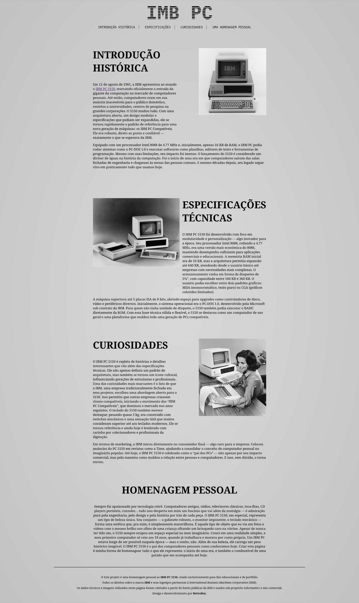

# 🖥️ IBM PC 5150 — Landing Page Homenagem

Uma homenagem visual, técnica e afetiva ao lendário **IBM PC 5150**, o computador pessoal que deu início a tudo. Este projeto foi criado com dedicação por quem tem verdadeira paixão por tecnologia retrô.



---

## 📜 Sobre o Projeto

O **IBM PC 5150** foi lançado em 1981 e marcou o início da era dos computadores pessoais acessíveis e padronizados. Este site é uma *landing page* criada para apresentar suas especificações, curiosidades e, principalmente, 
homenagear sua importância histórica e pessoal na vida do criador.

---

## ✨ Destaques da Página

- 🧠 Especificações técnicas detalhadas
- 📚 Curiosidades históricas
- ❤️ Depoimento pessoal
- ⚙️ HTML + CSS puro (sem frameworks)

---

## 💡 Objetivo

Este projeto foi criado como parte do meu portfólio e como um tributo pessoal ao 5150 — uma máquina que representa tudo aquilo que me fascina na história da computação: simplicidade, engenharia, beleza e legado.

---

## 🛠️ Tecnologias Usadas

- HTML5
- CSS3
- VS Code
- Git & GitHub

---

## 🚀 Como Rodar Localmente

Clone o repositório:

```bash
git clone https://github.com/seu-usuario/landing-ibm-pc5150.git
cd landing-ibm-pc5150
